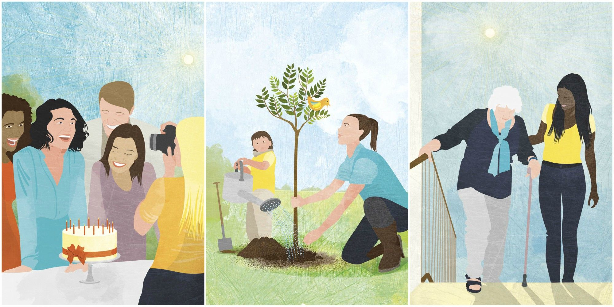

#### kindness 

  
kindness is actually a quality which resides in every human being.kindness is defined as being friendly,generous,considerate.Often kindness is seen as a weakness but being kind in typical situations require courage,strength which many people lack.An act of kindness and gentleness is often appreciated and lovable by everyone.kindness can be in many forms and by many ways.We can make our lives, our surroundings ,our relationships 
more merrier and lovable by a simple act a kindness.kindness also includes being kind to one's self too.We never actually know what someone is going through or what someone is thinking about so it is better to be kind to one another because one can never know how much a simple word or an act or a behaviour can affect a person's state of mind,thoughts or spirit.

Here is a short story which i have listened to recently

 It was somewhere across europe,during the war.Where there is a lot of chaos around the people ,places and the policemen were involved and thieves and robberies were to be seen.where everything is in so much of a rush around.Trains were to be filled with loads of goods and people.There was a little boy and a little girl who were waiting near the compartment for a train.The train was delayed and didn't reach yet so the boy and the girl started playing around.Meanwhile the boy seem to keep his shoes aside and continued to play.After a few long hours of wait a train came by and the policemen then rushed everyone into the train as soon as possible including the little boy and the little girl,but the boy forgot to wear his shoes in this hurdle.After reaching their home,the elder sister of the boy notices that the boy is missing his shoes.The sister got angry because it was during winter and the boy do need his shoes to be warm and scolded the little boy and slapped him.Sooner the elder sister left the country for some work and after the return she found out that 5 members of her family were dead during the war including her brother and there were no records of them at all.The sister was devasted,she remembered the last conversation she had with her brother and felt terrible since she loved her brother so much but what was last said to him did not end well.Since then she decided as, if it were the last conversation she will have with anyone she would not want to regret it.From then on she lived a fruitfull life.

From this story what i want to conclude is we never know when will be the last time we speak to someone.So it is better to be conscious and be kind to everyone around without having regrets.It is better to be helpfull to others and be kind.Also,**It is never too late to begin**.This is what i have been practising lately and hoped to share.  
             

                         

                       